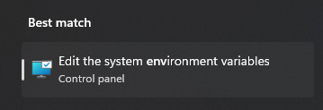
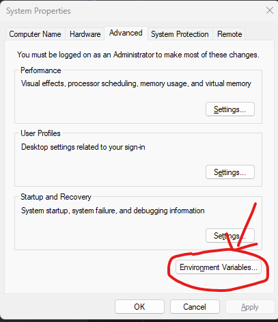
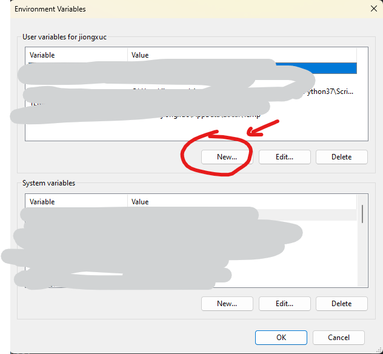
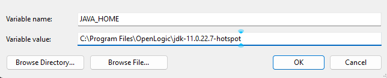
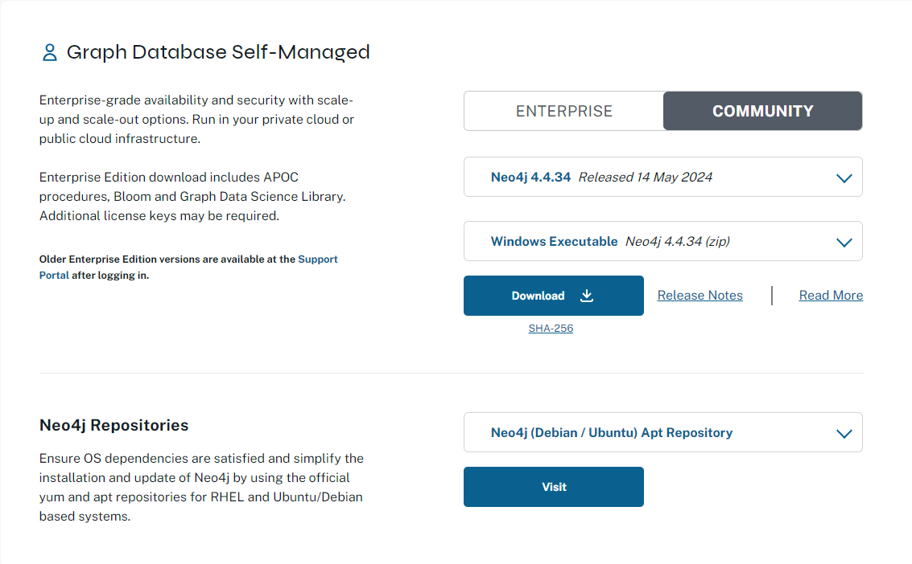
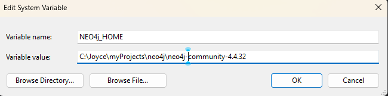
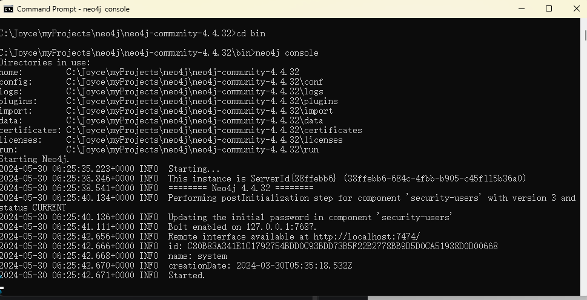

🌳 Welcome to our ***EX BER BER TEA*** Team! 🌟 We're a group of avid learners 📚 who are passionate about 🤓 understanding and sharing our knowledge 🧠 with each other. Our mission 🚀 is to cultivate a diverse garden 🌱 of insights and wisdom 💡, nurturing each other's growth 🌱 along the way. From the roots 🌿 of foundational concepts to the vibrant blooms 🌺 of cutting-edge discoveries, we're committed to 🤝 supporting one another on our learning journey. Together, we'll explore 🌍 new branches 🌿 of knowledge and chart the course 🗺️ to greater understanding. Join us as we embark on this exciting adventure! 🚀✨

# Installation

## Installation Guide for Neo4j on Windows 11

<details>
<summary>Step 1: Install Java</summary>

1. Download and install JRE from [Open Logic official website](https://www.openlogic.com/openjdk-downloads).  
   <span style="color:gray">JDK and JRE have differences. JDK (Java Development Kit) includes the Java Runtime Environment (JRE) and Java development tools. On the other hand, JRE (Java Runtime Environment) is the environment required to run Java programs. If you only want to run Java programs, you only need to install the JRE. However, if you wish to develop Java programs, you must install the JDK.</span>
   - Select the version needed for Neo4j. We use JAVA 11. Select to download the msi file.  
     
      1. Open the downloaded .msi file.
      2. Install JRE following the instructions and keep notes of your installation path.

2. Set up the Java environment path.
   - Search `environment` on the start menu.  
     
   - Click "Environment Variables".  
     
   - Click "Environment Variables" in "System Properties".  
     
   - Add new user variables.  
     
   - Add JAVA_HOME.  
     

</details>

<details>
<summary>Step 2: Install Neo4j</summary>

1. Download Neo4j Community Version from the [official Neo4j website deployment center](https://neo4j.com/deployment-center/).
   - Select the executable for Windows.  
     

2. Install Neo4j.
   - Extract the zip file.
   - Move the extracted folder to your desired path and keep notes of the path.

3. Set up the Neo4j environment path.
   - Repeat the steps to access "Environment Variables" from Step 1.
   - Add NEO4j_HOME.  
     

4. Start Neo4j program.
   - Start a command prompt window.  
     
   - Change the directory to the Neo4j directory, then change the directory to `bin`.  
     
   - Input `neo4j console`.
   - You can see your Neo4j program running at `http://localhost:7474/`.

</details>
<details>
<summary>Step 3: Setting up Python Environment</summary>

1. download and install anaconda.
    - Go to the [Anaconda Distribution page](https://www.anaconda.com/products/distribution).
    - Choose the appropriate version for your operating system (Windows, macOS, or Linux) and download the installer.
    - Install Anaconda:
        - **Windows:**
            - Run the downloaded .exe installer.
            - Follow the instructions in the setup wizard. It’s generally recommended to install for "Just Me" and to add Anaconda to your PATH environment variable.

2. create environment.
    - Open Anaconda Prompt (Windows).
    - Create a new environment:
      ```sh
      conda create --name ex_per_per_tea python=3.11
      ```
      `ex_per_per_tea` is our desired environment name and `3.11` with the Python version we need.

3. activate environment.
    - **Windows:**
      ```sh
      conda activate ex_per_per_tea
      ```
 
4. install requirement.txt.
    - Change directory to the folder where you saved this project. You probably need to set up a proxy if you are using a company network.
     - Install the packages listed in `requirements.txt`:
      ```sh
      pip install -r requirements.txt
      ```
</details>

# Running the Application
1. **Start neo4j**
    - Repeat the steps to access "Start Neo4j program" from Installation, Install Neo4j.
2. **Run the Python Application**:
    - Navigate to the directory containing `app.py`.
    - Run the application using the following command:
      ```bash
      python app.py
      ```

# Neo4j Database Structure
## Node Types:
- `Content`: Represents different types of content in the database.
- `KnowledgeTreeEle`: Nodes in the knowledge tree.
- `PeopleNode`: Nodes representing people who review content.
- `Review`: Represents reviews for each content.

## Relationships:
- `(:KnowledgeTreeEle)-[:HAS_CONTENT]->(:Content)`: Indicates that a node in the knowledge tree has associated content.
- `(:Content)-[:HAS_REVIEW]->(:Review)`: Content nodes have reviews associated with them.
- `(:Review)-[:BELONG_TO]->(:PeopleNode)`: Reviews belong to specific people.

# Key Points
## Maintaining Knowledge Tree
- Maintain a tree structure of the knowledge tree.
- Add content to the most leaf tag on the knowledge tree.
- The knowledge tree can only be updated when at least 3 members of the core team reach an agreement.

### Content Types:
1. Project
2. Course
3. Book
4. Mentorship
5. Certificate
6. Self-Summary
7. Achievement
8. Event
9. SharingSession

# How to Add Nodes

All the code to create nodes is stored in the `neo4j_management` folder.

## Adding a Node to the Knowledge Tree

To add a node to the knowledge tree, follow these steps:

1. Open [knowledge_tree.py](neo4j_management%2Fknowledge_tree.py) and add code in`create_technical_tree()`, `create_soft_skill_tree()`, or `create_soft_skill_tree()`.
2. Add the following lines of code:
    ```python
    # Choose a unique name for your node
    # Example: popular_science_books
    popular_science_books = self.create_knowledge_tree_node("popular_science_books", "Popular Science Books")
    self.create_knowledge_tree_relation(fun_node, popular_science_books)
    ```
    This is to create a relationship between this node and its father branch. Note that `popular_science_books` should be a globally unique name.

## Adding a Content Node

To add a content node, follow these steps:
1. Open [content_node.py](neo4j_management%2Fcontent_node.py) and add code in `create_content_nodes()`.
2. Define the content node as follows:
    ```python
    logxpert_sbc = {
        "content_uniquev": "logxpert_sbc",
        "name": "LogXpert: efficient log analysis tool for SBC",
        "type": "Project",
        "info": "hahahha</p>"
    }
    content_node.create_content_node_relation("finetuning", logxpert_sbc)
    content_node.create_content_node_relation("retrieval_augmented_generation", logxpert_sbc)
    content_node.create_content_node_relation("python", logxpert_sbc)
    ```

    This is to include all the information and create relations to all the nodes it may attach to in the knowledge tree. Note that you can use HTML in the info field. Note that `content_uniquev` should be unique and it should also be the name of the variable.

## Adding a Review Node

To add a review node, follow these steps:
1. Open [review_node.py](neo4j_management%2Freview_node.py) and add code in `create_review_nodes()`.
2. Define the review node:
    ```python
    review_node = cls(graph, n_matcher, r_matcher)
    experpert1_kubernetes_jora = {
        "review_id": "experpert1_kubernetes_review_jora",
        "stars": 5,
        "comments": "The best and most complete basics of kubernetes training.",
        "status": "In Progress"
    }
    review_node.create_review_node_relation("experpert1_kubernetes", "jora",  experpert1_kubernetes_jora)
    ```
   This is to include all the information and create relations to the content node it attaches to.  Note that `review_id` should be unique and it should also be the name of the variable.


## Running the Program to Add All Nodes

- If you only add nodes without modifying existing ones, run:
    ```bash
    python create_everything.py
    ```

- If you also modify existing nodes or relationships, first, in your Neo4j database, run:
    ```agsl
    MATCH (n)
    DETACH DELETE n;
    ```
    And then, 
    ```bash
    python create_everything.py
    ```

## References
- [Neo4j Installation Guide (Chinese)](https://www.cnblogs.com/ljhdo/p/5521577.html)
